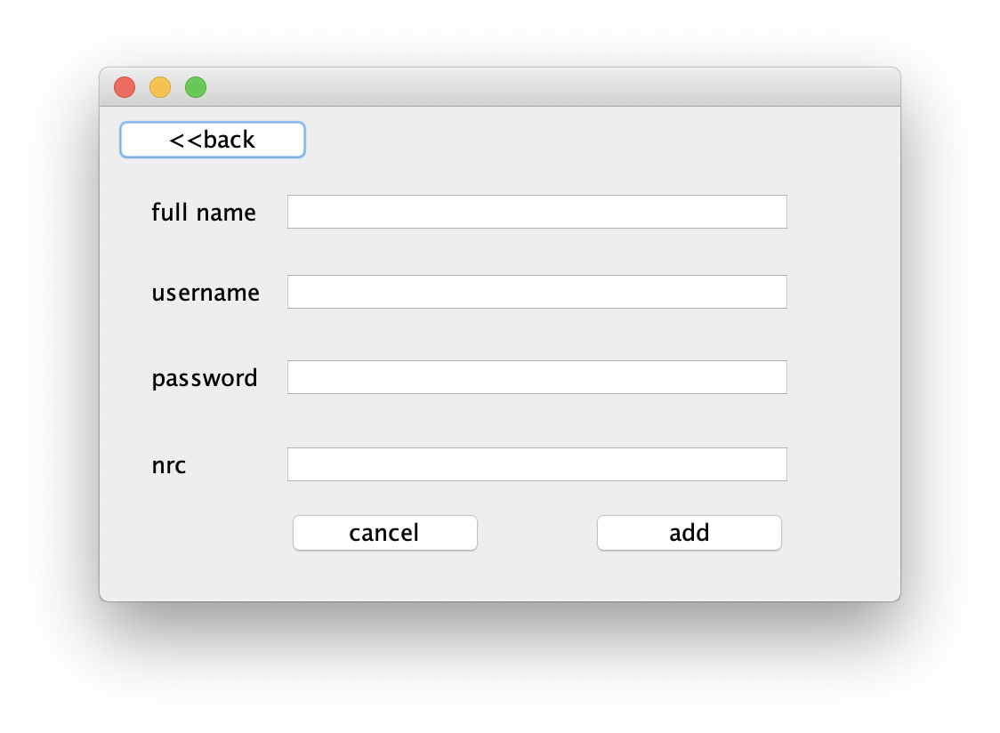

# Library-Management-System
This project is all about library management system with Java and MySQL

# Installation
1. Open Library Management System folder. You'll see 2 files; a folder and a SQL file.
2. Import SQL file on MySQL database.
3. Library Management System folder to existing project on eclipse.
4. Click Run.

#### Or

1. Download and run **.jar** file.

# UI Design
Ordinary swing library is used.

### UI for admin side

### UI for user side

